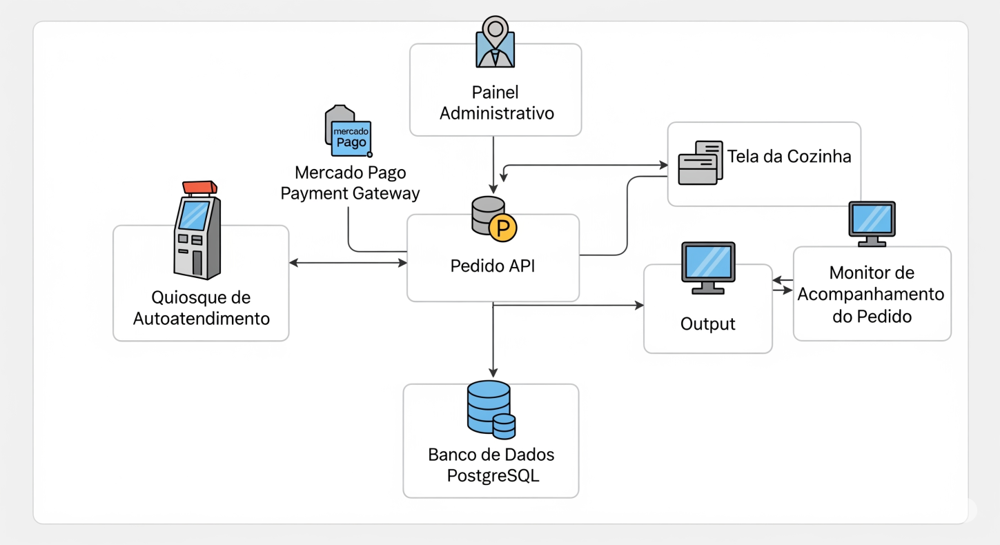

## 🧠 Arquitetura Kubernetes: Solução para Gerenciamento de Acessos à Aplicação - TechChallenge

### 🧩 Cenário do Problema

Aplicações modernas enfrentam diversos desafios relacionados a acesso, disponibilidade e escalabilidade. 
Essa arquitetura Kubernetes feita especificamente para o projeto Techchallenge resolve:

- Acesso seguro e escalável
- Roteamento inteligente de requisições
- Resiliência e tolerância a falhas
- Isolamento e desacoplamento de componentes
- Escalabilidade automática

---

### Desenho da solução técnica abstração

### ✅ Como a Arquitetura Resolve os Desafios

#### 🔷 1. Ingress Controller — Entrada controlada e roteada

- Atua como gateway HTTP/HTTPS
- Centraliza o roteamento para os serviços
- Lida com TLS, autenticação e balanceamento

**Resolve:** Roteamento, segurança e exposição controlada

---

### 🚀 2. Application Service e Deployment

- `Service: app`: proxy interno estável
- `Deployment: app`: gerencia os pods da aplicação (réplicas, updates, resiliência)
- `HPA`: autoescalabilidade baseada em carga

**Resolve:** Alta disponibilidade, escalabilidade, resiliência

---

### 🔐 3. Secrets e ConfigMaps

- `ConfigMap`: variáveis de ambiente não sensíveis
- `Secret`: informações sensíveis (senhas, tokens)

**Resolve:** Segurança e desacoplamento de configurações

---

### 🗃️ 4. Banco de Dados (PostgreSQL) com Persistência

- `Deployment: db`: roda o banco
- `Service: db`: expõe para a aplicação
- `PVC: db`: garante persistência dos dados

**Resolve:** Persistência, isolamento, confiabilidade

---

### 📡 5. Kafka e Zookeeper — Mensageria resiliente

- `Kafka`: broker de eventos
- `Zookeeper`: gerencia estado do cluster Kafka
- `PVCs`: garantem persistência de logs e mensagens

**Resolve:** Comunicação assíncrona, desacoplamento e resiliência

---

### 🔄 6. Comunicação Interna via Services

- Comunicação via nomes de serviço (service discovery)
- Sem dependência de IPs fixos
- Rede segura e interna

**Resolve:** Comunicação estável, escalável e segura

---
### Abaixo a solução de toda arquitetura Kubernetes para resolver o problema de disponibilidade : 

## 🧰 Resumo dos Benefícios Técnicos

| Problema                           | Solução                                |
|------------------------------------|-----------------------------------------|
| Tráfego externo desorganizado     | Ingress Controller + HTTPS              |
| Escalabilidade manual             | HPA sobre o Deployment                  |
| Downtime em atualizações          | Rolling Updates via Deployments         |
| Exposição de dados sensíveis      | Secrets + ConfigMaps                    |
| Perda de dados em crash           | PVCs nos bancos e filas                 |
| Acoplamento entre serviços        | Kafka + Services isolados               |
| Falta de alta disponibilidade     | Kubernetes replica pods automaticamente |

